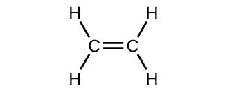

By the end of this section, you will be able to:
* Describe multiple covalent bonding in terms of atomic orbital overlap
* Relate the concept of resonance to π-bonding and electron delocalization

The hybrid orbital model appears to account well for the geometry of molecules involving single covalent bonds. Is it also capable of describing molecules containing double and triple bonds? We have already discussed that multiple bonds consist of σ and π bonds. Next we can consider how we visualize these components and how they relate to hybrid orbitals. The Lewis structure of ethene, C2H4, shows us that each carbon atom is surrounded by one other carbon atom and two hydrogen atoms.

The three bonding regions form a trigonal planar electron-pair geometry. Thus we expect the σ bonds from each carbon atom are formed using a set of *sp*2 hybrid orbitals that result from hybridization of two of the 2*p* orbitals and the 2*s* orbital ([\[link\]](#CNX_Chem_08_03_sp3config)). These orbitals form the C–H single bonds and the σ bond in the <math xmlns="http://www.w3.org/1998/Math/MathML"><mrow><mtext>C</mtext><mo>=</mo><mtext>C</mtext></mrow></math>

 double bond ([\[link\]](#CNX_Chem_08_03_C2H4orbit))*.* The π bond in the <math xmlns="http://www.w3.org/1998/Math/MathML"><mrow><mtext>C</mtext><mo>=</mo><mtext>C</mtext></mrow></math>

 double bond results from the overlap of the third (remaining) 2*p* orbital on each carbon atom that is not involved in hybridization. This unhybridized *p* orbital (lobes shown in red and blue in [\[link\]](#CNX_Chem_08_03_C2H4orbit)) is perpendicular to the plane of the *sp*2 hybrid orbitals. Thus the unhybridized 2*p* orbitals overlap in a side-by-side fashion, above and below the internuclear axis ([\[link\]](#CNX_Chem_08_03_C2H4orbit)) and form a π bond*.*

![A diagram is shown in two parts, connected by a right facing arrow labeled, &#x201C;Hybridization.&#x201D; The left diagram shows an up-facing arrow labeled, &#x201C;E.&#x201D; To the lower right of the arrow is a short, horizontal line labeled, &#x201C;2 s,&#x201D; that has two vertical half-arrows facing up and down on it. To the upper right of the arrow are a series of three short, horizontal lines labeled, &#x201C;2 p.&#x201D; Above both sets of lines is the phrase, &#x201C;Orbitals in an isolated C atom.&#x201D; Two of the lines have vertical, up-facing arrows drawn on them. The right side of the diagram shows three short, horizontal lines placed halfway up the space and each labeled, &#x201C;s p superscript 2.&#x201D; An upward-facing half arrow is drawn vertically on each line. Above these lines is one other short, horizontal line, labeled, &#x201C;p.&#x201D; Above both sets of lines is the phrase, &#x201C;Orbitals in the s p superscript 2 hybridized C atom in C subscript 2 H subscript 4.&#x201D;](../resources/CNX_Chem_08_03_sp3config.jpg "In ethene, each carbon atom is sp2 hybridized, and the sp2 orbitals and the p orbital are singly occupied. The hybrid orbitals overlap to form &#x3C3; bonds, while the p orbitals on each carbon atom overlap to form a &#x3C0; bond."){: #CNX_Chem_08_03_sp3config}

![Two diagrams are shown labeled, &#x201C;a&#x201D; and &#x201C;b.&#x201D; Diagram a shows two carbon atoms with three purple balloon-like orbitals arranged in a plane around them and two red balloon-like orbitals arranged vertically and perpendicularly to the plane. There is an overlap of two of the purple orbitals in between the two carbon atoms, and the other four purple orbitals that face the outside of the molecule are shown interacting with spherical blue orbitals from four hydrogen atoms. Diagram b depicts a similar image to diagram a, but the red, vertical orbitals are interacting above and below the plane of the molecule to form two areas labeled, &#x201C;One pi bond.&#x201D;](../resources/CNX_Chem_08_03_C2H4orbit.jpg "In the ethene molecule, C2H4, there are (a) five &#x3C3; bonds. One C&#x2013;C &#x3C3; bond results from overlap of sp2 hybrid orbitals on the carbon atom with one sp2 hybrid orbital on the other carbon atom. Four C&#x2013;H bonds result from the overlap between the C atoms' sp2 orbitals with s orbitals on the hydrogen atoms. (b) The &#x3C0; bond is formed by the side-by-side overlap of the two unhybridized p orbitals in the two carbon atoms. The two lobes of the &#x3C0; bond are above and below the plane of the &#x3C3; system."){: #CNX_Chem_08_03_C2H4orbit}

In an ethene molecule, the four hydrogen atoms and the two carbon atoms are all in the same plane. If the two planes of *sp*2 hybrid orbitals tilted relative to each other, the *p* orbitals would not be oriented to overlap efficiently to create the π bond. The planar configuration for the ethene molecule occurs because it is the most stable bonding arrangement. This is a significant difference between σ and π bonds; rotation around single (σ) bonds occurs easily because the end-to-end orbital overlap does not depend on the relative orientation of the orbitals on each atom in the bond. In other words, rotation around the internuclear axis does not change the extent to which the σ bonding orbitals overlap because the bonding electron density is symmetric about the axis. Rotation about the internuclear axis is much more difficult for multiple bonds; however, this would drastically alter the off-axis overlap of the π bonding orbitals, essentially breaking the π bond.

In molecules with *sp* hybrid orbitals, two unhybridized *p* orbitals remain on the atom ([\[link\]](#CNX_Chem_08_03_spC)). We find this situation in acetylene, <math xmlns="http://www.w3.org/1998/Math/MathML"><mrow><mtext>H−C≡C−H</mtext><mo>,</mo></mrow></math>

 which is a linear molecule. The *sp* hybrid orbitals of the two carbon atoms overlap end to end to form a σ bond between the carbon atoms ([\[link\]](#CNX_Chem_08_03_C2H2)). The remaining *sp* orbitals form σ bonds with hydrogen atoms. The two unhybridized *p* orbitals per carbon are positioned such that they overlap side by side and, hence, form two π bonds. The two carbon atoms of acetylene are thus bound together by one σ bond and two π bonds, giving a triple bond.

{: #CNX_Chem_08_03_spC}

![Two diagrams are shown and labeled, &#x201C;a&#x201D; and &#x201C;b.&#x201D; Diagram a shows two carbon atoms with two purple balloon-like orbitals arranged in a plane around each of them, and four red balloon-like orbitals arranged along the y and z axes perpendicular to the plane of the molecule. There is an overlap of two of the purple orbitals in between the two carbon atoms. The other two purple orbitals that face the outside of the molecule are shown interacting with spherical blue orbitals from two hydrogen atoms. Diagram b depicts a similar image to diagram a, but the red, vertical orbitals are interacting above and below and to the front and back of the plane of the molecule to form two areas labeled, &#x201C;One pi bond,&#x201D; and, &#x201C;Second pi bond,&#x201D; each respectively.](../resources/CNX_Chem_08_03_C2H2.jpg "(a) In the acetylene molecule, C2H2, there are two C&#x2013;H &#x3C3; bonds and a C&#x2261;C triple bond involving one C&#x2013;C &#x3C3; bond and two C&#x2013;C &#x3C0; bonds. The dashed lines, each connecting two lobes, indicate the side-by-side overlap of the four unhybridized p orbitals. (b) This shows the overall outline of the bonds in C2H2. The two lobes of each of the &#x3C0; bonds are positioned across from each other around the line of the C&#x2013;C &#x3C3; bond."){: #CNX_Chem_08_03_C2H2}

Hybridization involves only σ bonds, lone pairs of electrons, and single unpaired electrons (radicals). Structures that account for these features describe the correct hybridization of the atoms. However, many structures also include resonance forms. Remember that resonance forms occur when various arrangements of π bonds are possible. Since the arrangement of π bonds involves only the unhybridized orbitals, resonance does not influence the assignment of hybridization.

For example, molecule benzene has two resonance forms ([\[link\]](#CNX_Chem_08_03_C6H6)). We can use either of these forms to determine that each of the carbon atoms is bonded to three other atoms with no lone pairs, so the correct hybridization is *sp*2. The electrons in the unhybridized *p* orbitals form π bonds. Neither resonance structure completely describes the electrons in the π bonds. They are not located in one position or the other, but in reality are delocalized throughout the ring. Valence bond theory does not easily address delocalization. Bonding in molecules with resonance forms is better described by molecular orbital theory. (See the next module.)

 {: #CNX_Chem_08_03_C6H6}

Assignment of Hybridization Involving Resonance Some acid rain results from the reaction of sulfur dioxide with atmospheric water vapor, followed by the formation of sulfuric acid. Sulfur dioxide, SO2, is a major component of volcanic gases as well as a product of the combustion of sulfur-containing coal. What is the hybridization of the S atom in SO2?

Solution The resonance structures of SO2 are

![Two Lewis structures connected by a double-ended arrow are shown. The left structure shows a sulfur atom with one lone pair of electrons and a positive sign which is single bonded on one side to an oxygen atom with three lone pairs of electrons and a negative sign. The sulfur atom is double bonded on the other side to another oxygen atom with two lone pairs of electrons. The right-hand structure is the same as the left except that the position of the double bonded oxygen atom is switched. In both structures the attached oxygen atoms form an acute angle in terms of the sulfur atom.](../resources/CNX_Chem_08_03_SO2_img.jpg)

The sulfur atom is surrounded by two bonds and one lone pair of electrons in either resonance structure. Therefore, the electron-pair geometry is trigonal planar, and the hybridization of the sulfur atom is *sp*2.

Check Your Learning Another acid in acid rain is nitric acid, HNO3, which is produced by the reaction of nitrogen dioxide, NO2, with atmospheric water vapor. What is the hybridization of the nitrogen atom in NO2? (Note: the lone electron on nitrogen occupies a hybridized orbital just as a lone pair would.)

Answer:

*sp*2

### Key Concepts and Summary

Multiple bonds consist of a σ bond located along the axis between two atoms and one or two π bonds. The σ bonds are usually formed by the overlap of hybridized atomic orbitals, while the π bonds are formed by the side-by-side overlap of unhybridized orbitals. Resonance occurs when there are multiple unhybridized orbitals with the appropriate alignment to overlap, so the placement of π bonds can vary.

### Chemistry End of Chapter Exercises

The bond energy of a C–C single bond averages 347 kJ mol−1; that of a <math xmlns="http://www.w3.org/1998/Math/MathML"><mrow><mtext>C</mtext><mo>≡</mo><mtext>C</mtext></mrow></math>

 triple bond averages 839 kJ mol−1. Explain why the triple bond is not three times as strong as a single bond.

A triple bond consists of one σ bond and two π bonds. A σ bond is stronger than a π bond due to greater overlap.

For the carbonate ion, <math xmlns="http://www.w3.org/1998/Math/MathML"><mrow><msub><mtext>CO</mtext><mn>3</mn></msub><msup><mrow /><mn>2−</mn></msup><mo>,</mo></mrow></math>

 draw all of the resonance structures. Identify which orbitals overlap to create each bond.

A useful solvent that will dissolve salts as well as organic compounds is the compound acetonitrile, H3CCN. It is present in paint strippers.

(a) Write the Lewis structure for acetonitrile, and indicate the direction of the dipole moment in the molecule.

(b) Identify the hybrid orbitals used by the carbon atoms in the molecule to form σ bonds.

(c) Describe the atomic orbitals that form the π bonds in the molecule. Note that it is not necessary to hybridize the nitrogen atom.

(a)* * *
{: data-type="newline"}

  
* * *
{: data-type="newline"}

 (b) The terminal carbon atom uses *sp*3 hybrid orbitals, while the central carbon atom is *sp* hybridized. (c) Each of the two π bonds is formed by overlap of a 2*p* orbital on carbon and a nitrogen 2*p* orbital.

For the molecule allene, <math xmlns="http://www.w3.org/1998/Math/MathML"><mrow><msub><mtext>H</mtext><mn>2</mn></msub><mtext>C</mtext><mo>=</mo><mtext>C</mtext><mo>=</mo><msub><mrow><mtext>CH</mtext></mrow><mn>2</mn></msub><mo>,</mo></mrow></math>

 give the hybridization of each carbon atom. Will the hydrogen atoms be in the same plane or perpendicular planes?

Identify the hybridization of the central atom in each of the following molecules and ions that contain multiple bonds:

(a) ClNO (N is the central atom)

(b) CS2

(c) Cl2CO (C is the central atom)

(d) Cl2SO (S is the central atom)

(e) SO2F2 (S is the central atom)

(f) XeO2F2 (Xe is the central atom)

(g) <math xmlns="http://www.w3.org/1998/Math/MathML"><mrow><msub><mtext>ClOF</mtext><mn>2</mn></msub><msup><mrow /><mtext>+</mtext></msup></mrow></math>

 (Cl is the central atom)

(a) *sp*2; (b) *sp*; (c) *sp*2; (d) *sp*3; (e) *sp*3; (f) *sp*3*d*; (g) *sp*3

Describe the molecular geometry and hybridization of the N, P, or S atoms in each of the following compounds.

(a) H3PO4, phosphoric acid, used in cola soft drinks

(b) NH4NO3, ammonium nitrate, a fertilizer and explosive

(c) S2Cl2, disulfur dichloride, used in vulcanizing rubber

(d) K4[O3POPO3], potassium pyrophosphate, an ingredient in some toothpastes

For each of the following molecules, indicate the hybridization requested and whether or not the electrons will be delocalized:

(a) ozone (O3) central O hybridization

(b) carbon dioxide (CO2) central C hybridization

(c) nitrogen dioxide (NO2) central N hybridization

(d) phosphate ion <math xmlns="http://www.w3.org/1998/Math/MathML"><mrow><mo stretchy="false">(</mo><msub><mtext>PO</mtext><mn>4</mn></msub><msup><mrow /><mn>3−</mn></msup><mo stretchy="false">)</mo></mrow></math>

 central P hybridization

(a) *sp*2, delocalized; (b) *sp*, localized; (c) *sp*2, delocalized; (d) *sp*3, delocalized

For each of the following structures, determine the hybridization requested and whether the electrons will be delocalized:

(a) Hybridization of each carbon

(b) Hybridization of sulfur

(c) All atoms

Draw the orbital diagram for carbon in CO2 showing how many carbon atom electrons are in each orbital.

![A diagram is shown in two parts, connected by a right facing arrow labeled, &#x201C;Hybridization.&#x201D; The left diagram shows an up-facing arrow labeled, &#x201C;E.&#x201D; To the lower right of the arrow is a short, horizontal line labeled, &#x201C;2 s,&#x201D; that has two vertical half-arrows facing up and down on it. To the upper right of the arrow are a series of three short, horizontal lines labeled, &#x201C;2 p.&#x201D; Above both sets of lines is the phrase, &#x201C;Orbitals in an isolated C atom.&#x201D; There are two upward facing arrows on two of these lines. The right side of the diagram shows two short, horizontal lines placed halfway up the space and each labeled, &#x201C;s p.&#x201D; An upward-facing half arrow is drawn vertically on each line. Above these lines are two other short, horizontal lines, each labeled, &#x201C;2 p,&#x201D; and which have two upward facing arrows on them. Above both sets of lines is the phrase, &#x201C;Orbitals in the s p hybridized C in C O subscript 2.&#x201D;](../resources/CNX_Chem_08_02_CO2Diag.jpg)

Each of the four electrons is in a separate orbital and overlaps with an electron on an oxygen atom.

