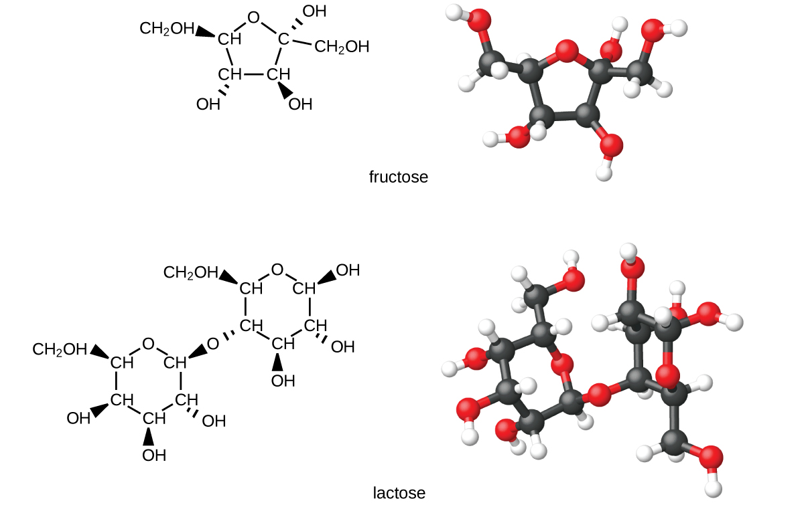

By the end of this section, you will be able to:
* Describe the structure and properties of alcohols
* Describe the structure and properties of ethers
* Name and draw structures for alcohols and ethers

In this section, we will learn about alcohols and ethers.

# Alcohols

Incorporation of an oxygen atom into carbon- and hydrogen-containing molecules leads to new functional groups and new families of compounds. When the oxygen atom is attached by single bonds, the molecule is either an alcohol or ether.

**Alcohols**{: data-type="term"} are derivatives of hydrocarbons in which an –OH group has replaced a hydrogen atom. Although all alcohols have one or more hydroxyl (–OH) functional groups, they do not behave like bases such as NaOH and KOH. NaOH and KOH are ionic compounds that contain OH– ions. Alcohols are covalent molecules; the –OH group in an alcohol molecule is attached to a carbon atom by a covalent bond.

Ethanol, CH3CH2OH, also called ethyl alcohol, is a particularly important alcohol for human use. Ethanol is the alcohol produced by some species of yeast that is found in wine, beer, and distilled drinks. It has long been prepared by humans harnessing the metabolic efforts of yeasts in fermenting various sugars:

    Large quantities of ethanol are synthesized from the addition reaction of water with ethylene using an acid as a catalyst:

    Alcohols containing two or more hydroxyl groups can be made. Examples include 1,2-ethanediol (ethylene glycol, used in antifreeze) and 1,2,3-propanetriol (glycerine, used as a solvent for cosmetics and medicines):

  ![Structural formulas for 1 comma 2 dash ethanediol and 1 comma 2 comma 3 dash propanetriol are shown. The first structure has a two C atom hydrocarbon chain with an O H group attached to each carbon. The O H groups are shown in red an each O atom has two sets of electron dots. Each C atom also has two H atoms bonded to it. The second structure shows a three C atom hydrocarbon chain with an O H group bonded to each carbon. The O H groups are shown in red, and each O atom has two sets of electron dots. The first C atom has two H atoms bonded to it. The second C atom has one H atom bonded to it. The third C atom has two H atoms bonded to it.](../resources/CNX_Chem_20_02_polyols_img.jpg)  ## Naming Alcohols

The name of an alcohol comes from the hydrocarbon from which it was derived. The final *-e* in the name of the hydrocarbon is replaced by *-ol*, and the carbon atom to which the –OH group is bonded is indicated by a number placed before the name.[1](#footnote1){: data-type="footnote-number" name="footnote-ref1"}

Naming Alcohols Consider the following example. How should it be named?

  
Solution The carbon chain contains five carbon atoms. If the hydroxyl group was not present, we would have named this molecule pentane. To address the fact that the hydroxyl group is present, we change the ending of the name to *-ol*. In this case, since the –OH is attached to carbon 2 in the chain, we would name this molecule 2-pentanol.

Check Your Learning Name the following molecule:

  

Answer:

2-methyl-2-pentanol

# Ethers

**Ethers**{: data-type="term"} are compounds that contain the functional group –O–. Ethers do not have a designated suffix like the other types of molecules we have named so far. In the IUPAC system, the oxygen atom and the smaller carbon branch are named as an alkoxy substituent and the remainder of the molecule as the base chain, as in alkanes. As shown in the following compound, the red symbols represent the smaller alkyl group and the oxygen atom, which would be named “methoxy.” The larger carbon branch would be ethane, making the molecule methoxyethane. Many ethers are referred to with common names instead of the IUPAC system names. For common names, the two branches connected to the oxygen atom are named separately and followed by “ether.” The common name for the compound shown in [\[link\]](#fs-idm48177328) is ethylmethyl ether:

    

Naming Ethers Provide the IUPAC and common name for the ether shown here:

  
Solution IUPAC: The molecule is made up of an ethoxy group attached to an ethane chain, so the IUPAC name would be ethoxyethane.

Common: The groups attached to the oxygen atom are both ethyl groups, so the common name would be diethyl ether.

Check Your Learning Provide the IUPAC and common name for the ether shown:

  

Answer:

IUPAC: 2-methoxypropane; common: isopropylmethyl ether

Ethers can be obtained from alcohols by the elimination of a molecule of water from two molecules of the alcohol. For example, when ethanol is treated with a limited amount of sulfuric acid and heated to 140 °C, diethyl ether and water are formed:

  ![This figure shows a reaction. The first molecule, which is labeled, &#x201C;ethanol,&#x201D; is a two C atom chain. The first C atom is bonded to three H atoms and a second C atom. The second C atom is bonded to a red O atom with two sets of electron dots. The O atom has a red bond to a red H atom. There is a plus sign. The next molecule, which is labeled, &#x201C;ethanol,&#x201D; is a red H atom with a red bond to a red O atom with two pairs of electron dots. The O atom is bonded to a C atom which is bonded to two H atoms and a second C atom. The second C atom is bonded to three H atoms. There is a green dotted box around the red H atom in the first molecule, the plus sign, and the red H and O atoms in the second molecule. To the right o the second molecule there is an arrow labeled H subscript 2 S O subscript 4 above and Greek capital delta below. The arrow is labeled, &#x201C;sulfuric acid.&#x201D; The resulting molecules are a C atom bonded with three H atoms and a second C atom. The second C atom is bonded to two H atoms and a red O atom. The red O atom has two sets of electron dots. The O atom is bonded to a third C atom which is bonded to two H atoms and a fourth C atom. The fourth C atom is bonded to three H atoms. This molecule is labeled, &#x201C;diethyl ether.&#x201D; There is a plus sign and a red H O H.](../resources/CNX_Chem_20_02_ether_img.jpg)  In the general formula for ethers, R—**O**{: .emphasis-one}—R, the hydrocarbon groups (R) may be the same or different. Diethyl ether, the most widely used compound of this class, is a colorless, volatile liquid that is highly flammable. It was first used in 1846 as an anesthetic, but better anesthetics have now largely taken its place. Diethyl ether and other ethers are presently used primarily as solvents for gums, fats, waxes, and resins. *Tertiary*-butyl methyl ether, C4H9OCH3 (abbreviated MTBE—italicized portions of names are not counted when ranking the groups alphabetically—so butyl comes before methyl in the common name), is used as an additive for gasoline. MTBE belongs to a group of chemicals known as oxygenates due to their capacity to increase the oxygen content of gasoline.

  
Want more practice naming ethers? This brief [video review][1] summarizes the nomenclature for ethers.

Carbohydrates and Diabetes

Carbohydrates are large biomolecules made up of carbon, hydrogen, and oxygen. The dietary forms of carbohydrates are foods rich in these types of molecules, like pastas, bread, and candy. The name “carbohydrate” comes from the formula of the molecules, which can be described by the general formula Cm(H2O)n, which shows that they are in a sense “carbon and water” or “hydrates of carbon.” In many cases, *m* and *n* have the same value, but they can be different. The smaller carbohydrates are generally referred to as “sugars,” the biochemical term for this group of molecules is “saccharide” from the Greek word for sugar ([\[link\]](#CNX_Chem_20_02_Sugars)). Depending on the number of sugar units joined together, they may be classified as monosaccharides (one sugar unit), disaccharides (two sugar units), oligosaccharides (a few sugars), or polysaccharides (the polymeric version of sugars—polymers were described in the feature box earlier in this chapter on recycling plastics). The scientific names of sugars can be recognized by the suffix *-ose* at the end of the name (for instance, fruit sugar is a monosaccharide called “fructose” and milk sugar is a disaccharide called lactose composed of two monosaccharides, glucose and galactose, connected together). Sugars contain some of the functional groups we have discussed: Note the alcohol groups present in the structures and how monosaccharide units are linked to form a disaccharide by formation of an ether.

{: #CNX_Chem_20_02_Sugars}

Organisms use carbohydrates for a variety of functions. Carbohydrates can store energy, such as the polysaccharides glycogen in animals or starch in plants. They also provide structural support, such as the polysaccharide cellulose in plants and the modified polysaccharide chitin in fungi and animals. The sugars ribose and deoxyribose are components of the backbones of RNA and DNA, respectively. Other sugars play key roles in the function of the immune system, in cell-cell recognition, and in many other biological roles.

Diabetes is a group of metabolic diseases in which a person has a high sugar concentration in their blood ([\[link\]](#CNX_Chem_20_02_Diabetes)). Diabetes may be caused by insufficient insulin production by the pancreas or by the body’s cells not responding properly to the insulin that is produced. In a healthy person, insulin is produced when it is needed and functions to transport glucose from the blood into the cells where it can be used for energy. The long-term complications of diabetes can include loss of eyesight, heart disease, and kidney failure.

In 2013, it was estimated that approximately 3.3% of the world’s population (~380 million people) suffered from diabetes, resulting in over a million deaths annually. Prevention involves eating a healthy diet, getting plenty of exercise, and maintaining a normal body weight. Treatment involves all of these lifestyle practices and may require injections of insulin.

"){: #CNX_Chem_20_02_Diabetes}

# Key Concepts and Summary

Many organic compounds that are not hydrocarbons can be thought of as derivatives of hydrocarbons. A hydrocarbon derivative can be formed by replacing one or more hydrogen atoms of a hydrocarbon by a functional group, which contains at least one atom of an element other than carbon or hydrogen. The properties of hydrocarbon derivatives are determined largely by the functional group. The –OH group is the functional group of an alcohol. The –R–O–R– group is the functional group of an ether.

# Chemistry End of Chapter Exercises

Why do the compounds hexane, hexanol, and hexene have such similar names?

Write condensed formulas and provide IUPAC names for the following compounds:

(a) ethyl alcohol (in beverages)

(b) methyl alcohol (used as a solvent, for example, in shellac)

(c) ethylene glycol (antifreeze)

(d) isopropyl alcohol (used in rubbing alcohol)

(e) glycerine

(a) ethyl alcohol, ethanol: CH3CH2OH; (b) methyl alcohol, methanol: CH3OH; (c) ethylene glycol, ethanediol: HOCH2CH2OH; (d) isopropyl alcohol, 2-propanol: CH3CH(OH)CH3; (e) glycerine, l,2,3-trihydroxypropane: HOCH2CH(OH)CH2OH

Give the complete IUPAC name for each of the following compounds:

(a)* * *
{: data-type="newline"}

   

(b)* * *
{: data-type="newline"}

   

(c)* * *
{: data-type="newline"}

  ![This shows a C H subscript 3 group bonded to a C H group. The C atom in the C H group is bonded to an O H group. The C H group is bonded to a C atom. The C atom is bonded below to a C l atom and above to a C H subscript 2 group. The C atom in the C H subscript 2 group is also bonded to a C H subscript 3 group. The C atom is also bonded to a C H subscript 2 group to the right. This C H subscript 2 group is bonded to another C H subscript 2 group. Below this second C H subscript 2 group a C H subscript 3 group is bonded.](../resources/CNX_Chem_20_02_Exercise3c_img.jpg) 

Give the complete IUPAC name and the common name for each of the following compounds:

(a)* * *
{: data-type="newline"}

   

(b)* * *
{: data-type="newline"}

   

(c)* * *
{: data-type="newline"}

   

(a) 1-ethoxybutane, butyl ethyl ether; (b) 1-ethoxypropane, ethyl propyl ether; (c) 1-methoxypropane, methyl propyl ether

Write the condensed structures of both isomers with the formula C2H6O. Label the functional group of each isomer.

Write the condensed structures of all isomers with the formula C2H6O2. Label the functional group (or groups) of each isomer.

HOCH2CH2OH, two alcohol groups; CH3OCH2OH, ether and alcohol groups

Draw the condensed formulas for each of the following compounds:

(a) dipropyl ether

(b) 2,2-dimethyl-3-hexanol

(c) 2-ethoxybutane

MTBE, Methyl *tert*-butyl ether, CH3OC(CH3)3, is used as an oxygen source in oxygenated gasolines. MTBE is manufactured by reacting 2-methylpropene with methanol.

(a) Using Lewis structures, write the chemical equation representing the reaction.

(b) What volume of methanol, density 0.7915 g/mL, is required to produce exactly 1000 kg of MTBE, assuming a 100% yield?

(a)* * *
{: data-type="newline"}

  ![A reaction is shown. The first molecule is a C atom bonded to another C atom. The first C atom (from left to right) is bonded to two C H subscript 3 groups. The second C atom is bonded to two H atoms. There is a plus sign. The next molecule shows an H atom bonded to an O atom bonded to a C H subscript 3 group. There is an arrow pointing right. This molecule shows a C atom bonded to three C H subscript 3 groups. The C atom is also bonded to an O atom which is also bonded to a C H subscript 3 group.](../resources/CNX_Chem_20_02_MTBE_img.jpg) ;* * *
{: data-type="newline"}

 (b) 4.593 <math xmlns="http://www.w3.org/1998/Math/MathML"><mo>×</mo></math>

 102 L

Write two complete balanced equations for each of the following reactions, one using condensed formulas and one using Lewis structures.

(a) propanol is converted to dipropyl ether

(b) propene is treated with water in dilute acid.

Write two complete balanced equations for each of the following reactions, one using condensed formulas and one using Lewis structures.

(a) 2-butene is treated with water in dilute acid

(b) ethanol is dehydrated to yield ethene

(a) <math xmlns="http://www.w3.org/1998/Math/MathML"><mrow><msub><mrow><mtext>CH</mtext></mrow><mn>3</mn></msub><mtext>CH</mtext><mo>=</mo><msub><mrow><mtext>CHCH</mtext></mrow><mn>3</mn></msub><mo>+</mo><msub><mtext>H</mtext><mn>2</mn></msub><mtext>O</mtext><mspace width="0.2em" /><mo stretchy="false">⟶</mo><mspace width="0.2em" /><msub><mrow><mtext>CH</mtext></mrow><mn>3</mn></msub><msub><mrow><mtext>CH</mtext></mrow><mn>2</mn></msub><msub><mrow><mtext>CH(OH)CH</mtext></mrow><mn>3</mn></msub></mrow></math>

* * *
{: data-type="newline"}

  ![A reaction is shown. The first molecule shows a C atom bonded with three H atoms. The first C atom is bonded to another C atom. The second C atom is bonded to an H atom and also forms a double bond with a third C atom. The third C atom is bonded to one H atom and fourth C atom. The fourth C atom is bonded to three H atoms. There is a plus sign. The second molecule shows an O atom with two sets of electron dots bonded to two H atoms. There is an arrow pointing right which is labeled, &#x201C;acid.&#x201D; The new molecule is a C atom bonded to three H atoms and a second C atom. The second C atom is bonded to two H atoms and a third C atom. The third C atom is bonded to an H atom and an O atom with two sets of electron dots. The O atom is bonded to an H atom. The third C atom is bonded to a fourth C atom which is bonded to three H atoms.](../resources/CNX_Chem_20_04_react2a_img.jpg) ;* * *
{: data-type="newline"}

 (b) <math xmlns="http://www.w3.org/1998/Math/MathML"><mrow><msub><mrow><mtext>CH</mtext></mrow><mn>3</mn></msub><msub><mrow><mtext>CH</mtext></mrow><mn>2</mn></msub><mtext>OH</mtext><mspace width="0.2em" /><mo stretchy="false">⟶</mo><mspace width="0.2em" /><msub><mrow><mtext>CH</mtext></mrow><mn>2</mn></msub><mo>=</mo><msub><mrow><mtext>CH</mtext></mrow><mn>2</mn></msub><mo>+</mo><msub><mtext>H</mtext><mn>2</mn></msub><mtext>O</mtext></mrow></math>

* * *
{: data-type="newline"}

   

## Footnotes
{: data-type="footnote-title"}

1.  [1](#footnote-ref1){: data-type="footnote-ref" name="footnote1"} The IUPAC adopted new nomenclature guidelines in 2013 that require this number to be placed as an “infix” rather than a prefix. For example, the new name for 2-propanol would be propan-2-ol. Widespread adoption of this new nomenclature will take some time, and students are encouraged to be familiar with both the old and new naming protocols.

## Glossary
{: data-type="glossary-title"}

alcohol
: organic compound with a hydroxyl group (–OH) bonded to a carbon atom
{: .definition}

ether
: organic compound with an oxygen atom that is bonded to two carbon atoms
{: .definition}

[1]: http://openstaxcollege.org/l/16ethers
