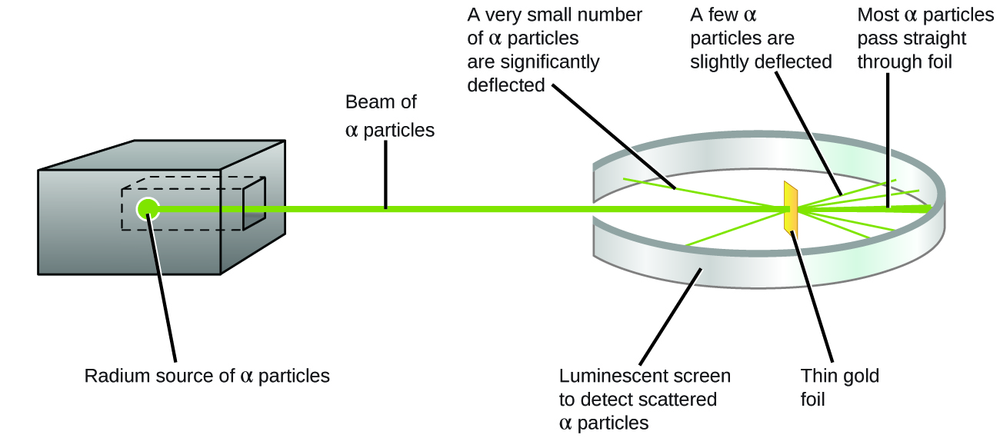
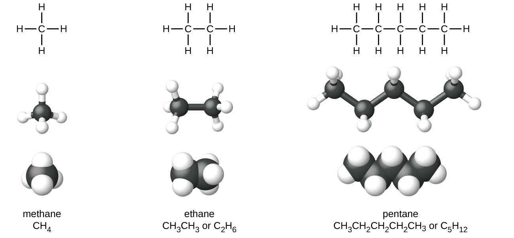
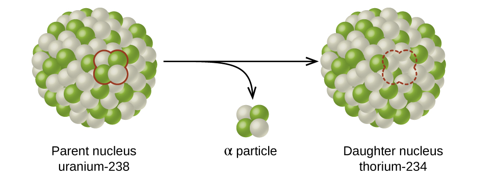

<section data-depth="1" markdown="1">
Welcome to *Chemistry*, an OpenStax resource. This textbook was written to increase student access to high-quality learning materials, maintaining highest standards of academic rigor at little to no cost.

## About OpenStax   {#eip-260}

OpenStax is a nonprofit based at Rice University, and it’s our mission to improve student access to education. Our first openly licensed college textbook was published in 2012, and our library has since scaled to over 25 books for college and AP® courses used by hundreds of thousands of students. Our adaptive learning technology, designed to improve learning outcomes through personalized educational paths, is being piloted in college courses throughout the country. Through our partnerships with philanthropic foundations and our alliance with other educational resource organizations, OpenStax is breaking down the most common barriers to learning and empowering students and instructors to succeed.

## About OpenStax Resources   {#eip-479}

### Customization   {#eip-475}

*Chemistry* is licensed under a Creative Commons Attribution 4.0 International (CC BY) license, which means that you can distribute, remix, and build upon the content, as long as you provide attribution to OpenStax and its content contributors.

Because our books are openly licensed, you are free to use the entire book or pick and choose the sections that are most relevant to the needs of your course. Feel free to remix the content by assigning your students certain chapters and sections in your syllabus, in the order that you prefer. You can even provide a direct link in your syllabus to the sections in the web view of your book.

Instructors also have the option of creating a customized version of their OpenStax book through the OpenStax Custom platform. The custom version can be made available to students in low-cost print or digital form through their campus bookstore. Visit your book page on openstax.org for a link to your book on OpenStax Custom.

### Errata   {#eip-597}

All OpenStax textbooks undergo a rigorous review process. However, like any professional-grade textbook, errors sometimes occur. Since our books are web based, we can make updates periodically when deemed pedagogically necessary. If you have a correction to suggest, submit it through the link on your book page on openstax.org. Subject matter experts review all errata suggestions. OpenStax is committed to remaining transparent about all updates, so you will also find a list of past errata changes on your book page on openstax.org.

### Format   {#eip-255}

You can access this textbook for free in web view or PDF through openstax.org, and in low-cost print and iBooks editions.

## About *Chemistry*   {#eip-905}

*Chemistry* is designed to meet the scope and sequence requirements of the two-semester general chemistry course. The textbook provides an important opportunity for students to learn the core concepts of chemistry and understand how those concepts apply to their lives and the world around them. The book also includes a number of innovative features, including interactive exercises and real-world applications, designed to enhance student learning.

### Coverage and Scope   {#eip-667}

Our *Chemistry* textbook adheres to the scope and sequence of most general chemistry courses nationwide. We strive to make chemistry, as a discipline, interesting and accessible to students. With this objective in mind, the content of this textbook has been developed and arranged to provide a logical progression from fundamental to more advanced concepts of chemical science. Topics are introduced within the context of familiar experiences whenever possible, treated with an appropriate rigor to satisfy the intellect of the learner, and reinforced in subsequent discussions of related content. The organization and pedagogical features were developed and vetted with feedback from chemistry educators dedicated to the project. 

Chapter 1: Essential Ideas

Chapter 2: Atoms, Molecules, and Ions

Chapter 3: Composition of Substances and Solutions

Chapter 4: Stoichiometry of Chemical Reactions

Chapter 5: Thermochemistry

Chapter 6: Electronic Structures and Periodic Properties of Elements

Chapter 7: Chemical Bonding and Molecular Geometry

Chapter 8: Advanced Theories of Covalent Bonding

Chapter 9: Gases

Chapter 10: Liquids and Solids

Chapter 11: Solutions and Colloids

Chapter 12: Kinetics

Chapter 13: Fundamental Equilibrium Concepts

Chapter 14: Acid-Base Equilibria

Chapter 15: Equilibria of Other Reaction Classes

Chapter 16: Thermodynamics

Chapter 17: Electrochemistry

Chapter 18: Representative Metals, Metalloids, and Nonmetals

Chapter 19: Transition Metals and Coordination Chemistry

Chapter 20: Organic Chemistry

Chapter 21: Nuclear Chemistry

### Pedagogical Foundation and Features   {#eip-951}

Throughout *Chemistry*, you will find features that draw the students into scientific inquiry by taking selected topics a step further. Students and educators alike will appreciate discussions in these feature boxes. 

**Chemistry in Everyday Life** ties chemistry concepts to everyday issues and real-world applications of science that students encounter in their lives. Topics include cell phones, solar thermal energy power plants, plastics recycling, and measuring blood pressure.

**How Sciences Interconnect** feature boxes discuss chemistry in context of its interconnectedness with other scientific disciplines. Topics include neurotransmitters, greenhouse gases and climate change, and proteins and enzymes.

**Portrait of a Chemist** presents a short bio and an introduction to the work of prominent figures from history and present day so that students can see the “face” of contributors in this field as well as science in action.

### Comprehensive Art Program   {#eip-88}

Our art program is designed to enhance students’ understanding of concepts through clear, effective illustrations, diagrams, and photographs.

             

### Interactives That Engage   {#eip-819}

*Chemistry* incorporates links to relevant interactive exercises and animations that help bring topics to life through our **Link to Learning** feature. Examples include: 

PhET simulations

IUPAC data and interactives

TED Talks

### Assessments that Reinforce Key Concepts   {#eip-638}

In-chapter **Examples** walk students through problems by posing a question, stepping out a solution, and then asking students to practice the skill with a “Check Your Learning” component. The book also includes assessments at the end of each chapter so students can apply what they’ve learned through practice problems.

## Additional Resources   {#eip-138}

### Student and Instructor Resources   {#eip-idm1034689360}

We’ve compiled additional resources for both students and instructors, including Getting Started Guides, an instructor solutions manual, and PowerPoint slides. Instructor resources require a verified instructor account, which you can apply for when you log in or create your account on openstax.org. Take advantage of these resources to supplement your OpenStax book.

### Partner Resources   {#eip-idm1165935696}

OpenStax Partners are our allies in the mission to make high-quality learning materials affordable and accessible to students and instructors everywhere. Their tools integrate seamlessly with our OpenStax titles at a low cost. To access the partner resources for your text, visit your book page on openstax.org.

## About the Authors   {#eip-384}

### Senior Contributing Authors   {#eip-4}

**Paul Flowers (Content Lead), University of North Carolina at Pembroke*** * *
{: data-type="newline"}

 Dr. Paul Flowers earned a BS in Chemistry from St. Andrews Presbyterian College in 1983 and a PhD in Analytical Chemistry from the University of Tennessee in 1988. After a one-year postdoctoral appointment at Los Alamos National Laboratory, he joined the University of North Carolina at Pembroke in the fall of 1989. Dr. Flowers teaches courses in general and analytical chemistry, and conducts experimental research involving the development of new devices and methods for microscale chemical analysis.

**Klaus Theopold (Content Lead), University of Delaware*** * *
{: data-type="newline"}

 Dr. Klaus Theopold (born in Berlin, Germany) received his Vordiplom from the Universität Hamburg in 1977. He then decided to pursue his graduate studies in the United States, where he received his PhD in inorganic chemistry from UC Berkeley in 1982. After a year of postdoctoral research at MIT, he joined the faculty at Cornell University. In 1990, he moved to the University of Delaware, where he is a Professor in the Department of Chemistry and Biochemistry and serves as an Associate Director of the University’s Center for Catalytic Science and Technology. Dr. Theopold regularly teaches graduate courses in inorganic and organometallic chemistry as well as general chemistry.

**Richard Langley (Content Lead), Stephen F. Austin State University*** * *
{: data-type="newline"}

 Dr. Richard Langley earned BS degrees in Chemistry and Mineralogy from Miami University of Ohio in the early 1970s and went on to receive his PhD in Chemistry from the University of Nebraska in 1977. After a postdoctoral fellowship at the Arizona State University Center for Solid State Studies, Dr. Langley taught in the University of Wisconsin system and participated in research at Argonne National Laboratory. Moving to Stephen F. Austin State University in 1982, Dr. Langley today serves as Professor of Chemistry. His areas of specialization are solid state chemistry, synthetic inorganic chemistry, fluorine chemistry, and chemical education.

**William R. Robinson, PhD**

### Contributing Authors   {#eip-693}

Mark Blaser, Shasta College* * *
{: data-type="newline"}

 Simon Bott, University of Houston* * *
{: data-type="newline"}

 Donald Carpenetti, Craven Community College* * *
{: data-type="newline"}

 Andrew Eklund, Alfred University* * *
{: data-type="newline"}

 Emad El-Giar, University of Louisiana at Monroe* * *
{: data-type="newline"}

 Don Frantz, Wilfrid Laurier University* * *
{: data-type="newline"}

 Paul Hooker, Westminster College* * *
{: data-type="newline"}

 Jennifer Look, Mercer University* * *
{: data-type="newline"}

 George Kaminski, Worcester Polytechnic Institute* * *
{: data-type="newline"}

 Carol Martinez, Central New Mexico Community College* * *
{: data-type="newline"}

 Troy Milliken, Jackson State University* * *
{: data-type="newline"}

 Vicki Moravec, Trine University* * *
{: data-type="newline"}

 Jason Powell, Ferrum College* * *
{: data-type="newline"}

 Thomas Sorensen, University of Wisconsin–Milwaukee* * *
{: data-type="newline"}

 Allison Soult, University of Kentucky* * *
{: data-type="newline"}

### Reviewers   {#eip-554}

Casey Akin, College Station Independent School District* * *
{: data-type="newline"}

 Lara AL-Hariri, University of Massachusetts–Amherst* * *
{: data-type="newline"}

 Sahar Atwa, University of Louisiana at Monroe* * *
{: data-type="newline"}

 Todd Austell, University of North Carolina–Chapel Hill* * *
{: data-type="newline"}

 Bobby Bailey, University of Maryland–University College* * *
{: data-type="newline"}

 Robert Baker, Trinity College* * *
{: data-type="newline"}

 Jeffrey Bartz, Kalamazoo College* * *
{: data-type="newline"}

 Greg Baxley, Cuesta College* * *
{: data-type="newline"}

 Ashley Beasley Green, National Institute of Standards and Technology* * *
{: data-type="newline"}

 Patricia Bianconi, University of Massachusetts* * *
{: data-type="newline"}

 Lisa Blank, Lyme Central School District* * *
{: data-type="newline"}

 Daniel Branan, Colorado Community College System* * *
{: data-type="newline"}

 Dorian Canelas, Duke University* * *
{: data-type="newline"}

 Emmanuel Chang, York College* * *
{: data-type="newline"}

 Carolyn Collins, College of Southern Nevada* * *
{: data-type="newline"}

 Colleen Craig, University of Washington* * *
{: data-type="newline"}

 Yasmine Daniels, Montgomery College–Germantown* * *
{: data-type="newline"}

 Patricia Dockham, Grand Rapids Community College* * *
{: data-type="newline"}

 Erick Fuoco, Richard J. Daley College* * *
{: data-type="newline"}

 Andrea Geyer, University of Saint Francis* * *
{: data-type="newline"}

 Daniel Goebbert, University of Alabama* * *
{: data-type="newline"}

 John Goodwin, Coastal Carolina University* * *
{: data-type="newline"}

 Stephanie Gould, Austin College* * *
{: data-type="newline"}

 Patrick Holt, Bellarmine University* * *
{: data-type="newline"}

 Kevin Kolack, Queensborough Community College* * *
{: data-type="newline"}

 Amy Kovach, Roberts Wesleyan College* * *
{: data-type="newline"}

 Judit Kovacs Beagle, University of Dayton* * *
{: data-type="newline"}

 Krzysztof Kuczera, University of Kansas* * *
{: data-type="newline"}

 Marcus Lay, University of Georgia* * *
{: data-type="newline"}

 Pamela Lord, University of Saint Francis* * *
{: data-type="newline"}

 Oleg Maksimov, Excelsior College* * *
{: data-type="newline"}

 John Matson, Virginia Tech* * *
{: data-type="newline"}

 Katrina Miranda, University of Arizona* * *
{: data-type="newline"}

 Douglas Mulford, Emory University* * *
{: data-type="newline"}

 Mark Ott, Jackson College* * *
{: data-type="newline"}

 Adrienne Oxley, Columbia College* * *
{: data-type="newline"}

 Richard Pennington, Georgia Gwinnett College* * *
{: data-type="newline"}

 Rodney Powell, Coastal Carolina Community College* * *
{: data-type="newline"}

 Jeanita Pritchett, Montgomery College–Rockville * * *
{: data-type="newline"}

 Aheda Saber, University of Illinois at Chicago* * *
{: data-type="newline"}

 Raymond Sadeghi, University of Texas at San Antonio* * *
{: data-type="newline"}

 Nirmala Shankar, Rutgers University* * *
{: data-type="newline"}

 Jonathan Smith, Temple University* * *
{: data-type="newline"}

 Bryan Spiegelberg, Rider University* * *
{: data-type="newline"}

 Ron Sternfels, Roane State Community College* * *
{: data-type="newline"}

 Cynthia Strong, Cornell College* * *
{: data-type="newline"}

 Kris Varazo, Francis Marion University* * *
{: data-type="newline"}

 Victor Vilchiz, Virginia State University* * *
{: data-type="newline"}

 Alex Waterson, Vanderbilt University* * *
{: data-type="newline"}

 JuchaoYan, Eastern New Mexico University* * *
{: data-type="newline"}

 Mustafa Yatin, Salem State University* * *
{: data-type="newline"}

 Kazushige Yokoyama, State University of New York at Geneseo* * *
{: data-type="newline"}

 Curtis Zaleski, Shippensburg University* * *
{: data-type="newline"}

 Wei Zhang, University of Colorado–Boulder* * *
{: data-type="newline"}

</section>

